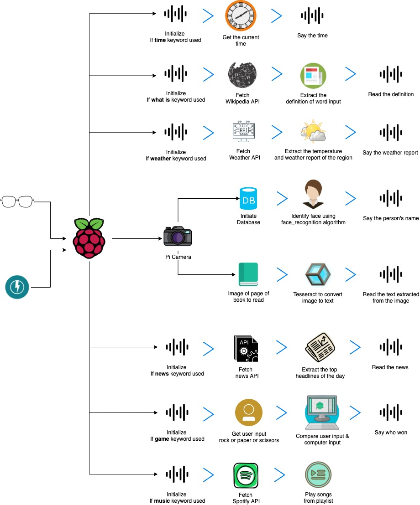

# Oculus

The primary goal of Oculus is  to provide assistance to  Visually Impaired people. Oculus has an assistant which is capable of performing a series of actions based on the users command.  

The assistant currently provides the following features:

- Recognize the person infront of the user
- Provides weather report
- Read texts, books, magazines with the help of ocr.
- Prevides everyday news
- Play music from Spotify
- Date and Time
- Play rock, paper, scissors
- Can learn anything from wikipedia

Everything will be returned to the user via earphones/headphones. This is achieved with the help of gTTS.

**NOTE:** If you are willing to test this on your system the working version of the system is availble inside testAssitant folder. Run main.py to use it. 

**Package/ Libraries/ Tech Used**

- OpenCV
- Tesseract OCR
- Python 
- News API
- Spotipy
- Speech Recognition
- gTTS
- Open Weather API

**Future Improvements**

- [ ] Adding GPS module to get users location
- [ ] Process the data retrieved from each API
- [ ] Add Obstacle detection